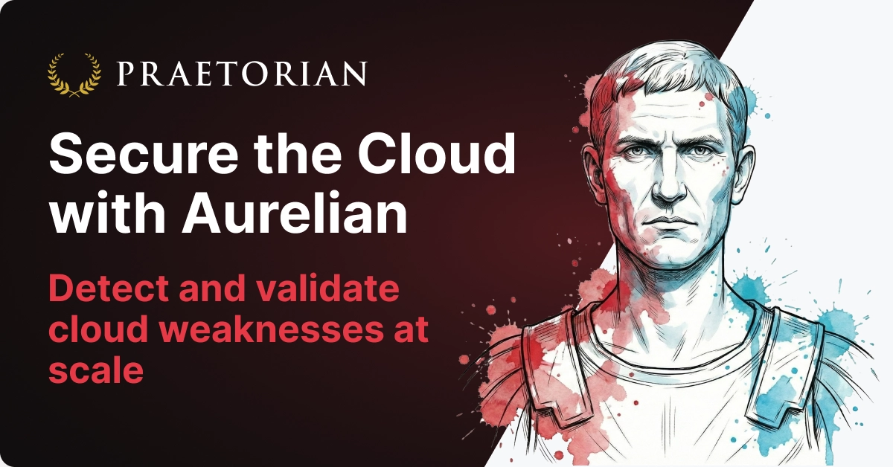

<h1 align="center">Aurelian</h1>

<p align="center">
  <em>Detect and validate cloud weaknesses at scale</em>
</p>

<p align="center">
<a href="https://github.com/praetorian-inc/aurelian/actions/workflows/build.yml"></a>
<a href="https://github.com/praetorian-inc/aurelian/releases"></a>
<a href="https://opensource.org/licenses/Apache-2.0"></a>
<a href="https://github.com/praetorian-inc/aurelian/stargazers"></a>
</p>

<p align="center">
  <a href="#features">Features</a> •
  <a href="#installation">Installation</a> •
  <a href="#quick-start">Quick Start</a> •
  <a href="#modules">Modules</a> •
  <a href="#documentation">Docs</a> •
  <a href="#library-usage">Library Usage</a>
</p>

> **One command. Any cloud.** Aurelian gives you a single, consistent interface for cloud security reconnaissance across AWS, Azure, and GCP — turning multi-step enumeration, secrets scanning, and misconfiguration detection into simple CLI calls.

Each module encapsulates a complex workflow behind a single command. `find-secrets` enumerates resources, extracts content from dozens of sources, and scans with [Titus](https://github.com/praetorian-inc/titus). `public-resources` combines resource listing, enrichment, policy fetching, and access evaluation. `subdomain-takeover` checks DNS records against cloud-specific takeover patterns. The interface stays the same — `aurelian [platform] recon [module]` — regardless of the cloud provider or the complexity underneath.

## Features

- **Unified Multi-Cloud Interface** — Same commands, same output, same workflow across AWS, Azure, and GCP
- **Complex Workflows, Simple Commands** — Each module orchestrates multi-step cloud API interactions behind a single CLI call
- **Secrets Discovery** — Enumerates resources, extracts content from 30+ source types (user data, environment variables, storage blobs, configuration), and scans with [Titus](https://github.com/praetorian-inc/titus)
- **OPSEC-Aware Operations** — Covert techniques that minimize CloudTrail logging and detection footprint
- **IAM Analysis** — Permission evaluation, privilege escalation path detection, and policy analysis
- **Subdomain Takeover Detection** — Dangling DNS detection for Cloud DNS, Route53, and Azure DNS
- **Configuration Scanning** — Azure Resource Graph template-based misconfiguration detection
- **Plugin Architecture** — Extensible module system with auto-generated CLI commands and parameter binding

## Installation

### From Source

```sh
git clone https://github.com/praetorian-inc/aurelian.git
cd aurelian
go build -o aurelian main.go
```

### Docker

```sh
docker build -t aurelian .
docker run --rm -v ~/.aws:/root/.aws aurelian aws recon whoami
```

A `docker-compose.yml` is included with credential volume mounts for all three cloud providers.

## Quick Start

The same pattern works across every cloud provider:

```sh
# Same command structure, any cloud
aurelian aws   recon find-secrets
aurelian azure recon find-secrets --subscription-id <id>
aurelian gcp   recon find-secrets --project-id <id>

# Public resource detection across providers
aurelian aws   recon public-resources
aurelian azure recon public-resources --subscription-id <id>
aurelian gcp   recon public-resources --project-id <id>

# Subdomain takeover detection
aurelian aws   recon subdomain-takeover
aurelian azure recon subdomain-takeover --subscription-id <id>
aurelian gcp   recon subdomain-takeover --project-id <id>

# OPSEC-safe identity check (avoids CloudTrail)
aurelian aws recon whoami

# List all available modules
aurelian list-modules
```

## Usage

```
aurelian [platform] [category] [module] [flags]
```

| Platform | Alias    | Description             |
|----------|----------|-------------------------|
| `aws`    | `amazon` | Amazon Web Services     |
| `azure`  | `az`     | Microsoft Azure         |
| `gcp`    | `google` | Google Cloud Platform   |

Modules are organized by category (`recon`, `analyze`) under each platform. Run `aurelian list-modules` for the full list.

## Documentation

Every command has detailed documentation in the [`docs/`](docs/) directory, auto-generated from the CLI help text. Each file covers usage, flags, and examples for a specific module.

| Path | Description |
|------|-------------|
| [`docs/aurelian_aws_recon.md`](docs/aurelian_aws_recon.md) | AWS reconnaissance modules |
| [`docs/aurelian_aws_analyze.md`](docs/aurelian_aws_analyze.md) | AWS analysis modules |
| [`docs/aurelian_azure_recon.md`](docs/aurelian_azure_recon.md) | Azure reconnaissance modules |
| [`docs/aurelian_gcp_recon.md`](docs/aurelian_gcp_recon.md) | GCP reconnaissance modules |

## Library Usage

Aurelian modules can be imported directly into Go applications via the plugin registry:

```go
import (
    "github.com/praetorian-inc/aurelian/pkg/plugin"
    _ "github.com/praetorian-inc/aurelian/pkg/modules/aws/recon"
)

mod, _ := plugin.Get("aws", "recon", "whoami")
results, err := mod.Run(cfg)
```

## License

Apache 2.0 — see [LICENSE](LICENSE) for details.

## Acknowledgements

Aurelian is developed and maintained by [Praetorian](https://www.praetorian.com/).
